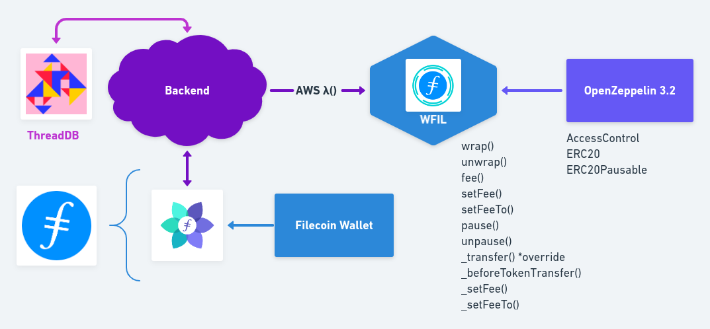

[](https://ubuntu.com/download/desktop)
[](https://github.com/nvm-sh/nvm#installation-and-update)
[](https://www.trufflesuite.com/)
[](https://github.com/ethereum/solidity/releases/tag/v0.6.12)
[](https://kovan.etherscan.io/address/0xeC41bA46D6a477e0a004a8e30566f3e9e4a7684b)


# WFIL

> Wrapped Filecoin 

`WFIL` is an ERC20 wrapper over Filecoin, reppresenting a stablecoin on deposits on a custodial Filecoin wallet (1:1 ratio).  

The current iteration implments a custodial pattern where users need to send filcoins to a custodial wallet and they'll get automatically the correspondent amount in `WFIL` to thier ethereum addresses.  

To unwrap `WFIL` a user need to burn `WFIL` with the function and specify a filecoin address where to receive the Filecoins.

Future Developments & Features:

We'd like to migrate to a non-custodial pattern where by leveraging on Filcoin smart contracts we'd be able to implement a fully decentralized application.  

One of the features we're considering is to add the permit() function to WFIL to allow meta transactions by leveraging on OpenZeppelin ERC20Permit module (currenlty in progress) and incentivise adoption in the space.

Applications:

- Uniswap
- WFIL as Collater on MakerDAO
- De-Fi
- ...

## Mentors

- Andrew W. Hill (Textile), [@andrewxhill](https://github.com/andrewxhill)  
- Aaron Sutula (Textile), [@asutula](https://github.com/asutula)
- Ignacio Hagopian (Textile) [@jsign](https://github.com/jsign)

[Demo]()  
[HackFS](http://hack.ethglobal.co/showcase/wfil-recCwbCnY2rnipjcR)  

## Sections
* [Building Blocks](#building-blocks)
* [Setup](#setup)
* [Deploy](#deploy)
* [Using the DApp](#using-the-dapp)
* [About](#about)

## Building Blocks



### [WFIL](./contracts/WFIL.sol)

### [Backend](https://github.com/cristiam86/wfil-backend)

### [Frontend](./app)

The Frontend has been implemented via Rimble UI & Rimble Web3 Components and deployed on IPFS via [Fleek](https://fleek.co/): [wfil.on.fleek.co](https://wfil.on.fleek.co)

### [Filecoin Wallet](https://wfil.on.fleek.co)


Setup
============

Clone this GitHub repository.

## Steps to compile and test

  - Local dependencies:
    - Truffle
    - Ganache CLI
    - OpenZeppelin Contracts v3.1.0
    - Truffle HD Wallet Provider
    - Truffle-Flattener
    ```sh
    $ npm i
    ```
  - Global dependencies:
    - Truffle (recommended):
    ```sh
    $ npm install -g truffle
    ```
    - Ganache CLI (recommended):
    ```sh
    $ npm install -g ganache-cli
    ```
    - Slither (optional): 
    ```sh
    $ git clone https://github.com/crytic/slither.git && cd slither
    $ sudo python3 setup.py install
    ```
    - MythX CLI (optional):
    ```sh
    $ git clone git://github.com/dmuhs/mythx-cli && cd mythx-cli
    $ sudo python setup.py install
    ```
## Running the project with local test network (ganache-cli)

   - Start ganache-cli with the following command (global dependency):
     ```sh
     $ ganache-cli
     ```
   - Compile the smart contract using Truffle with the following command (global dependency):
     ```sh
     $ truffle compile
     ```
   - Deploy the smart contracts using Truffle & Ganache with the following command (global dependency):
     ```sh
     $ truffle migrate
     ```
   - Test the smart contracts using Mocha & OpenZeppelin Test Environment with the following command:
     ```sh
     $ npm test
     ```
   - Analyze the smart contracts using Slither with the following command (optional):
      ```sh
      $ slither .
      ```
   - Analyze the smart contracts using MythX CLI with the following command (optional):
     ```sh
     $ mythx analyze
     ```
     
Deploy
============
## Deploy on Kovan Testnet
 - Get an Ethereum Account on Metamask.
 - On the landing page, click “Get Chrome Extension.”
 - Create a .secret file cointaining the menomic.
 - Get some test ether from a [Kovan's faucet](https://faucet.kovan.network/).
 - Signup [Infura](https://infura.io/).
 - Create new project.
 - Copy the kovan URL into truffle-config.js.
 - Uncomment the following lines in truffle-config.js:
   ```
   // const HDWalletProvider = require("@truffle/hdwallet-provider");
   // const infuraKey = '...';
   // const infuraURL = 'https://kovan.infura.io/...';

   // const fs = require('fs');
   // const mnemonic = fs.readFileSync(".secret").toString().trim();
   ```
 - Install Truffle HD Wallet Provider:
   ```sh
   $ npm install @truffle/hdwallet-provider
   ```
 - Deploy the smart contract using Truffle & Infura with the following command:
   ```sh
   $ truffle migrate --network kovan
   ```
   
## Project deployed on Kovan
[WFIL.sol](https://kovan.etherscan.io/address/0xeC41bA46D6a477e0a004a8e30566f3e9e4a7684b)

Using the DApp
==============
  - Install [Ganache GUI](https://www.trufflesuite.com/ganache).
  - Change Ganache GUI port to 8545.
  - Import Ganache GUI mnemonic into MetaMask.
  - Connect MetaMask to Ganache GUI, adding a custom RPC specifing the Ganache GUI's RPC server URL.
  - Deploy the smart contracts to Ganache GUI:
    ```
    $ truffle migrate
    ```
  - Move to client directory on the project:
    ```sh
    $ cd app
    ```
  - Install dependencies:
    ```sh
    $ yarn install
    ```
  - Start the Local Web Server:
    ```sh
    $ npm run start
    ```

About
============
## Inspiration & References

- [WBTC](https://etherscan.io/address/0x2260fac5e5542a773aa44fbcfedf7c193bc2c599#code)
- [WETH](https://etherscan.io/address/0xc02aaa39b223fe8d0a0e5c4f27ead9083c756cc2#code)
- [Chai](https://github.com/dapphub/chai)
- [EIP 2612](https://github.com/ethereum/EIPs/blob/8a34d644aacf0f9f8f00815307fd7dd5da07655f/EIPS/eip-2612.md)
- [EIP 712](https://eips.ethereum.org/EIPS/eip-712)
- [ERC-2612](https://github.com/ethereum/EIPs/issues/2613)
- [How to use permit function and relayers to pay gas for Dai transactions in Dai](https://github.com/makerdao/developerguides/blob/master/dai/dai-permit-function/how-to-use-permit-function.md)
- [Add ERC20 permit() function (OpenZeppelin)](https://github.com/OpenZeppelin/openzeppelin-contracts/issues/2206)
- [Understanding Wrapped Bitcoin and the Wrapped Tokens Framework](https://medium.com/@mutheevincent/understanding-wrapped-bitcoin-and-the-wrapped-tokens-framework-6ed45e52acdb)

## Authors

Project created by [Nazzareno Massari](https://nazzarenomassari.com) and [Cristiam Da Silva](https://cristiamdasilva.com/).  
Team WrapFS for HackFS ETHGlobal Virtual Hackathon.  
Logo by Cristiam Da Silva.
